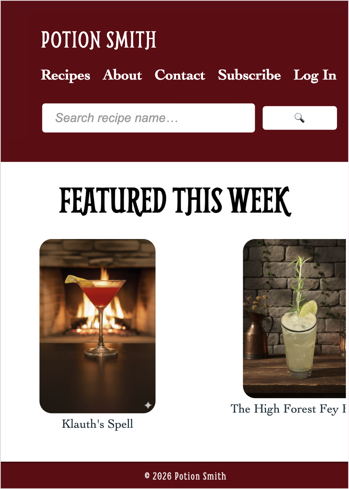
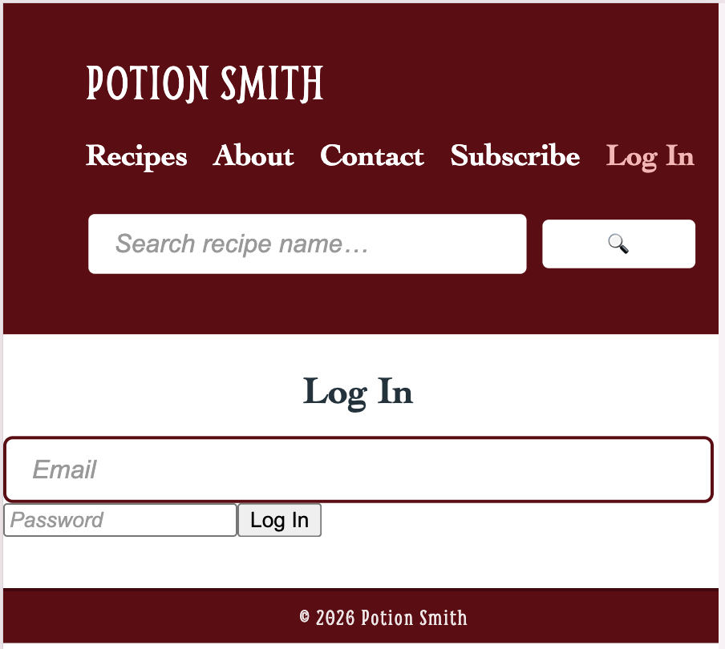
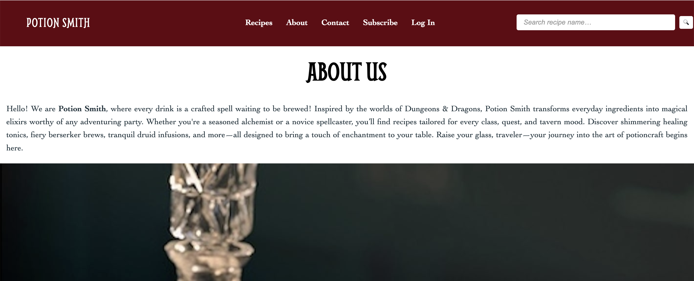
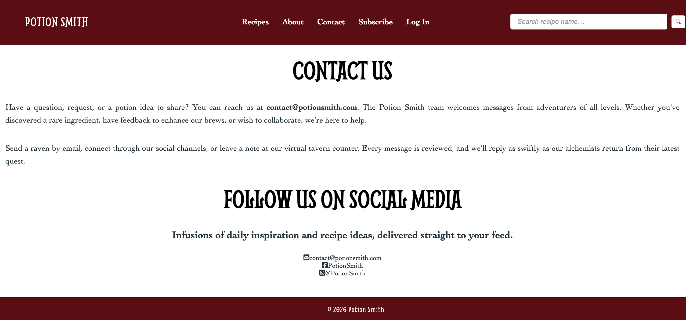
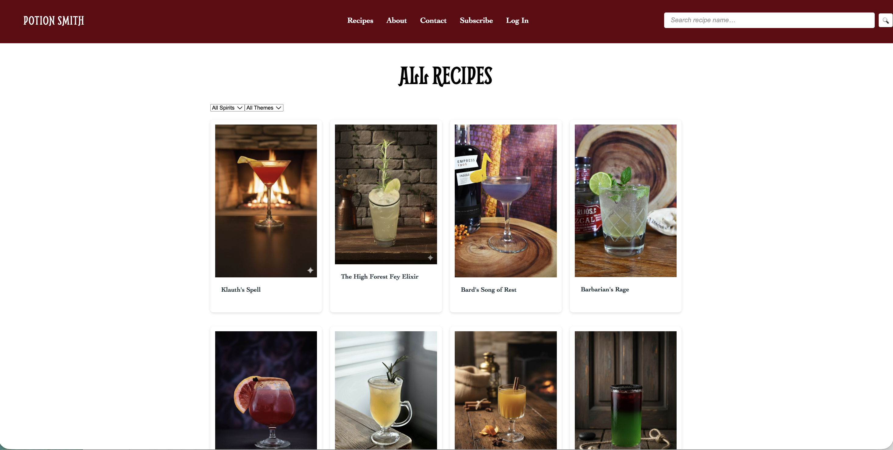
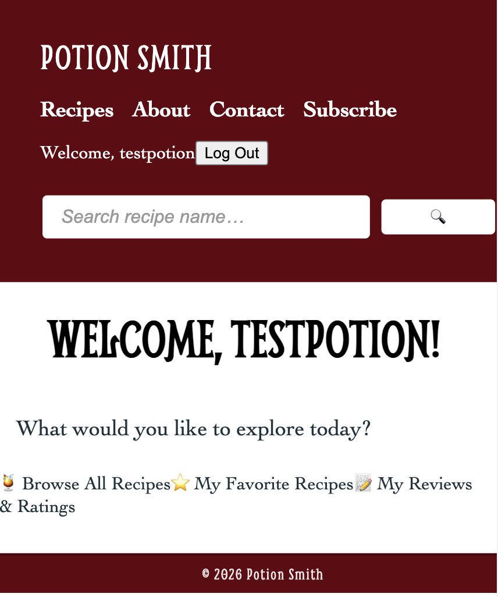

# Potion Smith: Full-Stack Web Application
## About The Project
Potion Smith is a **full-stack web application** that allows users to browse, search, and explore a curated collection of Dungeons & Dragons themed drink recipes, including cocktails and non-alcoholic options. The app focuses on delivering an engaging user experience with dynamic filtering, detailed recipe views, and user interaction features such as ratings and favorites.
## Features

**Recipe Discovery**
- Browse all recipes in a responsive grid layout
- Search recipes by name
- Filter recipes by spirit category or theme

**Recipe Details Page**
- View full recipe information including ingredients, step-by-step instructions and recipe image
- Interactive features: Rate recipes, Save as favorite, Recipe Reviews

**User Experience**
- Age verification (Age Gate)
- Login access for registered user to leave ratings, reviews, and save as favorite
- Navigation between pages using React Router

## Key Visuals
**Wireframes w/ Site Map**: 
[Click here](https://www.canva.com/design/DAHBdanOEzQ/T2NZ-o-4lq3um50FBUuyjw/edit?utm_content=DAHBdanOEzQ&utm_campaign=designshare&utm_medium=link2&utm_source=sharebutton)

**Preview of UI**

<details>
<summary>Home Page</summary>
<div align="middle">
  
</div>
</details>

<details>
<summary>Login Form</summary>
<div align="middle">
  
</div>
</details>

<details>
<summary>About Page</summary>
<div align="middle">
  
</div>
</details>

<details>
<summary>Contact Page</summary>
<div align="middle">
  
</div>
</details>

<details>
<summary>Recipes Page</summary>
<div align="middle">
  
</div>
</details>

<details>
<summary>User Dashboard</summary>
<div align="middle">
  
</div>
</details>


## Tech Stack
**Frontend**
- React (Vite)
- React Router
- JavaScript (ES6+)
- CSS
- Vite
- Google fonts
- Prettier
- Eslint

**Backend**
- Java
- Spring Boot
- Maven
- Hibernate
- MySQL

## Prerequisites & Installations
To run this project locally, you will need the following installed:
- Node.js
- npm or yarn
- Java Development Kit (JDK) 21
- MySQL Server (version 8.0+)

## Back End Setup (Java/Spring Boot/MySQL)
1. **Clone the repository**: In the terminal, navigate to the directory where you want the project to live, then execute the following commands:
```
git clone https://github.com/PuiSlate/unit-2-final-project-Poonnang-S.git # or your link,
cd unit-2-final-project-Poonnang-S/potion-smith-backend
```
2. **Configure secrets for database**: Create a new MySQL database named `potion_smith_backend`, then create an `.env` file at the project root directory (`potion-smith-backend`):
```
# Location of your local database server
DB_HOST=localhost
DB_PORT=3306

# Database name
DB_NAME=potion_smith_backend

# Credentials
DB_USER=root
DB_PASS=[your_password]
```
3. **Seed database with data**: I seeded my database manually using Postman by sending POST requests to my API. This allowed me to test my endpoints while also populating the database. I also verified the data using MySQL Workbench to ensure everything was stored correctly.
4. **Run the Java/Spring Boot application**: If you do not have the application loaded in an IDE such as IntelliJ, go to the terminal and navigate to the root directory of the backend project. Then execute the following command to build and run the application (Hibernate will automatically create the tables):
```
mvn spring-boot:run
```
The API should now be running on `http://localhost:8080`

5. **Register as a user**: Using a tool such as Postman, make a POST request to `http://localhost:8080/api/users/add` with a JSON body structured as follows:
```
{
  "username": "testpotion",
  "email": "potion@email.com",
  "age": 25,
  "password": "4321"
}
```
## Front End Setup (React/Vite)
1. **Navigate to the front end project directory**:
   ```
   cd ../potion-smith-frontend
   ```
2. **Install dependencies**:
   ```
   npm install
   ```
3. **Run the React/Vite application**:
   ```
   npm run dev
   ```
   The frontend application will start and can be found in a browser, typically at `http://localhost:5173`.


  
